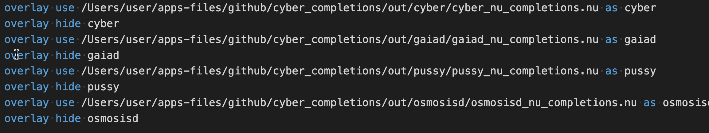

- `git clone https://github.com/cyber-prophet/cosmos-sdk-CLI-completions-for-nushell`
- In the folder `out` find the needed folder and there find completions file (like `pussy_nu_completions.nu`)
- enter the command
	- `overlay use /path/to/pussy_nu_completions.nu as pussy`
- try if nu gives you completions after typing `pussy` and hitting TAB
-
- if it works, add the previous command into the end of nu config:
	- `config nu`
		- `overlay use /path/to/pussy_nu_completions.nu as pussy`
		- `overlay hide pussy`
-
- I use `overlay hide pussy` in the config, as if there are several completions installed in nushell, their results can be a mess.
	- 
- When I need the specific completion I use command:
	- `overlay use pussy`
-