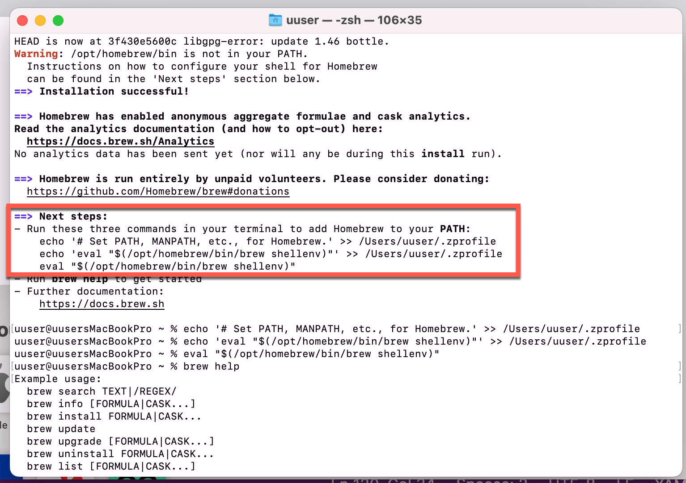

title:: cyber-prophet extra 1: installing mac from 0

- Software installation
	- https://brew.sh/
		- ```/bin/bash -c "$(curl -fsSL https://raw.githubusercontent.com/Homebrew/install/HEAD/install.sh)"
		  ```
		- 
		- Check that brew installed with `brew help` command
	- Go compile
		- `brew install go`
	- Git
		- `brew install git`
	- Visual Studio Code
		- `brew install --cask visual-studio-code`
- Building cyber
	- Creating new directory
		- `mkdir gitfolder`
		- `cd gitfolder`
	- Clonning repository
		- `git clone https://github.com/cybercongress/go-cyber.git`
	- Checking if cyber is installed correctly
		- `cyber version`
	- So we found that we need to add `~/go/bin` path to $PATH variable
		- `pwd`
		- `export PATH=$PATH:/Users/uuser/go/bin`
			- ```
			  > cyber version
			  0.3.2
			  ```
- Installing nushell
	- `brew install nushell`
	- Launching nu
		- `nu`
- Installing Alacritty terminal
	- `brew install --cask alacritty`
	- To open the application 'Alacrity' for the first time - click on it's icon with right click and choose the 'open' button
		-
- Configurate Alacritty
	- to use nushell as default shell
	- to change the size of fonts
- In Alacritty
	-
	-